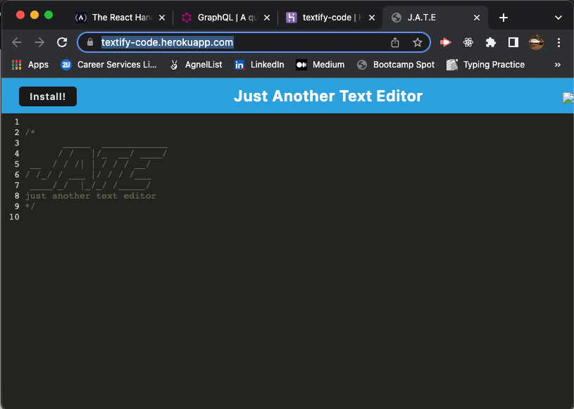

# J.A.T.E.  

  

  
  ## Description  

  

  A browser based text editor for Javascript code writing.  

  * Motivation  

    This was an exersize in using webpack service workers to cache and deliver page assets to users for offline working.  

  * Reason for Building  

    This project was built to use wbpack configuration to imple=iment a PWA with asset caching.  

  * Problems Solved  

    This allows users to continue to work on Javascript files without needing a heavy weigth text editor if they already have a Browser installed. The caching mechanisms at play also allow for continued seamless UIUX and functionality even when the internet connection is unstable or interrupted.  

  * Things Learned  

    This project was my first dive into setting up a webpack configuration file and my first installable PWA. I learend a lot about the impleimentation and use of a Manifest JSON file and service workers in regards to how htey can give users better end experiences.  

  

  ## Table of Contents  

  

  * [Installation](#installation)  

  * [Usage](#usage)  

  * [License](#license)  

  * [Contributing](#contributing)  

  * [Tests](#tests)  

  * [Questions](#questions)  

  

  ## Installation  

  

  This application is installed simply by visiting the URL for the heroku application. [Link Here](https://textify-code.herokuapp.com/)  

  

    

  

  ## Usage  

  

  Just click into the text field and type. The caching saves all progress behind the scenes.  

  

  ## License  

  

  [MIT](https://opensource.org/licenses/MIT)  

  ## Tests  

  

  This application does not currently have any tests.  

  

  ## Questions  

  

  Reach out if you have any questions about this project.
